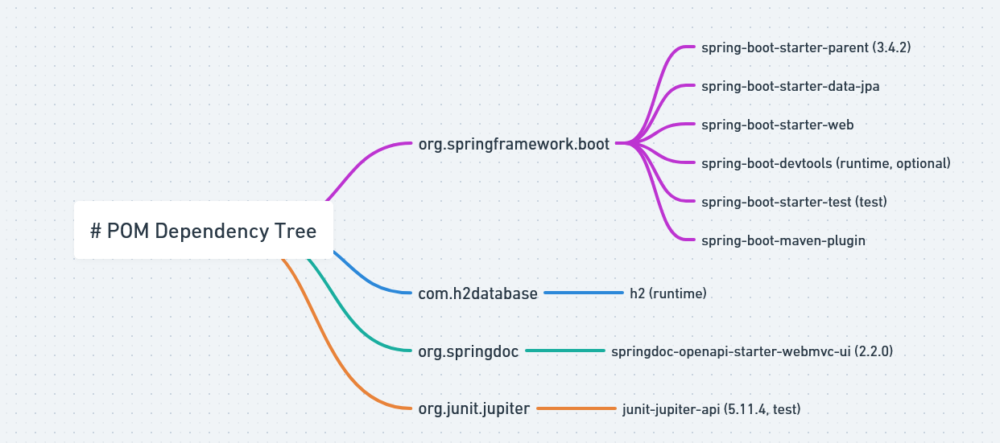

# Employee Study Case

## Overview
The **Employee Study Case** is a Spring Boot application that provides functionalities for managing employee data. It includes features such as employee creation, retrieval, filtering, and centralized exception handling. The project demonstrates best practices in Spring Boot development, including the use of DTOs, JPA specifications, and service-based architecture.

---

## Features
- **Create Employee**: Add new employees with detailed information.
- **Search Employees**: Filter employees based on name and salary range.
- **View Employee by ID**: Retrieve detailed information about a specific employee.
- **Exception Handling**: Handles application-specific and generic exceptions.
- **DTO-based Design**: Ensures clean separation between entity and API layers.

---

## Technologies Used
- **Java**: Programming language.
- **Spring Boot**: Framework for application development.
  - Spring Data JPA: Data persistence.
  - Spring Web: RESTful API development.
  - Spring Validation: Input validation.
- **H2 Database**: In-memory database for testing and development.
- **Mockito**: For unit testing.
- **JUnit 5**: Testing framework.
- **Maven**: Build and dependency management tool.

---

## Project Dependencies




## Prerequisites

Before running this application, ensure you have the following installed:

- Java 17 or higher
- Maven 3.8+
- An IDE like IntelliJ IDEA or Eclipse

---

## Setup and Run

### Clone the Repository
```bash
https://github.com/CemHarput/EmployeeStudyCase.git
cd EmployeeStudyCase
```

### Build the Project
Run the following command to build the project using Maven:
```bash
mvn clean install
```

### Run the Application
Use the following command to start the application:
```bash
mvn spring-boot:run
```

### Access the Application
The application will be available at:
```
http://localhost:8080
```

---

## API Endpoints

### Employee Management

1. **Create Employee**
   - **POST** `/employees`
   - Request Body:
     ```json
     {
       "firstName": "John",
       "lastName": "Doe",
       "dateOfBirth": "1990-01-01",
       "joinDate": "2020-01-01",
       "salary": 50000,
       "department": "IT"
     }
     ```
   - Response:
     ```json
     {
       "id": 1
     }
     ```

2. **Get Employees**
   - **GET** `/employees`
   - Query Parameters:
     - `name` (optional): Filter by first or last name.
     - `fromSalary` (optional): Minimum salary.
     - `toSalary` (optional): Maximum salary.
   - Example:
     ```bash
     GET /employees?name=John&fromSalary=40000&toSalary=60000
     ```

3. **Get Employee by ID**
   - **GET** `/employees/{id}`
   - Response:
     ```json
     {
       "id": 1,
       "firstName": "John",
       "lastName": "Doe",
       "dateOfBirth": "1990-01-01",
       "joinDate": "2020-01-01",
       "salary": 50000,
       "department": "IT"
     }
     ```

---

## Unit Testing

### Run Unit Tests
To run the unit tests:
```bash
mvn test
```

### Test Coverage
The application includes unit tests for:
- Employee creation.
- Employee retrieval by ID.
- Filtering employees by criteria.
- Exception handling.

---

## Project Structure
```
src/main/java
├── com.Studycase.employee
│   ├── controller          # REST controllers
│   ├── dto                 # Data Transfer Objects
│   ├── enums               # Enum definitions
│   ├── exception           # Custom exceptions
│   ├── model               # JPA entity classes
│   ├── repository          # Repository interfaces
│   ├── service             # Service layer
│   └── EmployeeStudyCaseApplication.java  # Main application
```

---

## Contributing
Contributions are welcome! To contribute:
1. Fork the repository.
2. Create a new branch (`git checkout -b feature/your-feature`).
3. Commit your changes (`git commit -m 'Add some feature'`).
4. Push to the branch (`git push origin feature/your-feature`).
5. Open a pull request.

---

## License
This project is licensed under the MIT License. See the LICENSE file for details.

---

## Contact
For any inquiries or issues, please reach out to the repository owner:
- **Cem Harput**
- GitHub: [CemHarput](https://github.com/CemHarput)

